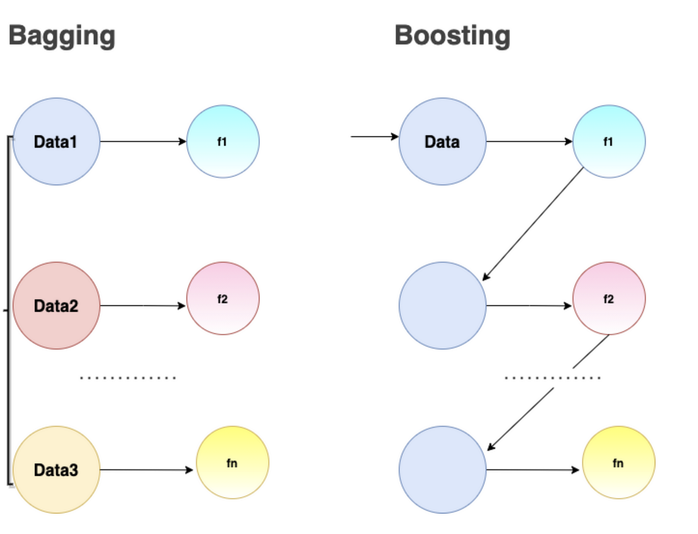
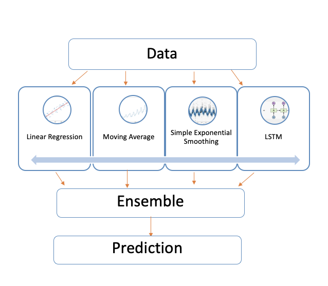
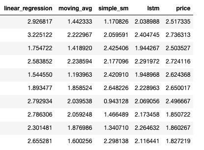
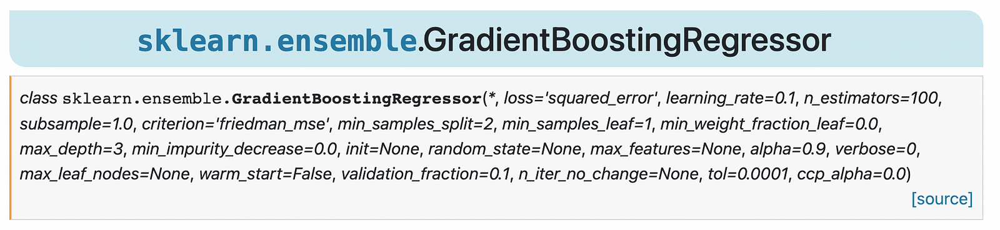
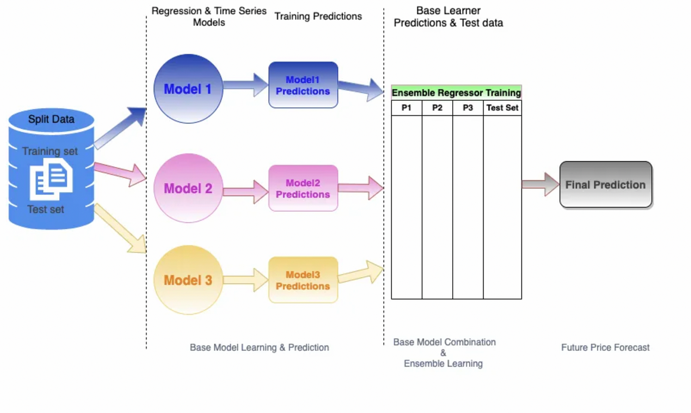

# Ensemble regression models for price forecasting

Ensemble methods are very popular and effective methods in machine learning, and in this post I'm going to illustrate how to _forecast prices using ensemble learning_.

While time series and regression models work well on their own, when combining these using ensemble methods we can get a better performing model and more accurate predictions for tomorrow's price values given historical data.

In this post, I will cover:
<li> Ensemble methods basics and fundamentals</li>
<li> Python code for ensembles using scikit-learn machine learning library</li>
<li> Ensemble Regression use case for price forecasting</li>

##What are ensemble models?

Ensemble models combine predictions from other simpler models to produce better predictions. There are two types of ensemble methods:

1) _parallel_ ensemble methods which combine independent learners to _reduce variance_
2) _sequential_ ensemble methods which combine models in order to _reduce bias and variance_

Parallel ensemble methods generate and train their base learners *in parallel* and these learners are *independent* of each other. Training parallel base estimators is also known as *Bagging* (Bootstrap Aggregation) and here we aggregate/average the individual base estimator predictions into one final prediction.

It is referred to as Bootstrap Aggregation since [bootstrap](https://en.wikipedia.org/wiki/Bootstrapping_(statistics)) sampling is used to sample the data subsets needed to train the base learners; simply put, bootstrapping sampling refers to sampling with replacement while assigning measures of accuracy to sample estimates.

The combined estimator uses averaging for regression problems and majority voting for classification problems; and this is usually better than the single base estimators because variance is reduced by averaging. [Random Forest](https://en.wikipedia.org/wiki/Random_forest) is an example of an effective bagging algorithm which aggregates over multiple decision trees, each trained using different bootstrapped samples as well as split on different features.



As the names suggests, sequential ensemble methods generate and train their base learners *sequentially* (one after the other), and these learners are *dependent* of each another. As such, the overall performance can be improved by weighing previously mislabeled/incorrect examples with higher weight; the goal is to reduce the bias of the combined estimator.

This method is also known as *Boosting* and [AdaBoost](https://scikit-learn.org/stable/modules/generated/sklearn.ensemble.AdaBoostRegressor.html) is an example of a popular and effective Boosting algorithm. The base learners are usually weak learners such as small decision trees trained on a weighted version of the data based on the previous learners' mistakes. Weights are increased based on correct and incorrect predictions, and more weight is given to more accurate learners. The final predictions are combined by a weighted sum or weighted majority vote.

Another example of a boosting algorithm is Gradient Boosting, which is the model used in this price forecasting use case. Since prices are predicted, the values (also known as labels) are numeric. As such, regression models are used as the base learners and then combined using [Gradient Boosting Regressor](https://scikit-learn.org/stable/modules/generated/sklearn.ensemble.GradientBoostingRegressor.html).

---

Below is a basic workflow of how models could feed base predictions to an ensemble learner which then would make final price predictions. In this illustration have chosen my base learners to be linear regression, moving averages, simple exponential smoothing and LSTM, but there are other models that could be used.



## Scikit-Learn API for Ensemble Methods
The scikit-learn python machine learning library provides Gradient Boosting ensembles methods for both [classification](https://scikit-learn.org/stable/modules/generated/sklearn.ensemble.GradientBoostingClassifier.html) and [regression](https://scikit-learn.org/stable/modules/generated/sklearn.ensemble.GradientBoostingRegressor.html) problems.

In the below example, after our import statements, we read the training data for our ensemble regressor - which is the output of our base model predictions - and then split the dataset into X and y.

```python 
# import statements
import pandas as pd
from sklearn.ensemble import GradientBoostingRegressor

# read csv file
df = pd.read_csv("price_data.csv")
```



In this case, the ensemble model is defined using 500 estimators and uses Absolute Error as its loss function. It is then fit to our data with one simple line of code. The next line of code makes predictions on our training data.

Please note that this is meant as a very simple example and that usually we need include additional steps into our modeling such as splitting the data into training and testing, [cross validation](https://scikit-learn.org/stable/modules/cross_validation.html) and analyze various error metrics for performance.

```python
# define model - let's start with 500 estimators
ensemble_regressor = GradientBoostingRegressor(random_state=23, loss='absolute_error',
n_estimators=500)

# fit the model
ensemble_regressor.fit(X, y)

# make predictions
ensemble_preds = ensemble_regressor.predict(X)
```

There are multiple hyper parameters that can be tuned such as the loss function, learning rate, min samples split, max depth and others.

The default loss function is squared error for regression, but we can chose from least absolute error, huber or quantile. The default criterion which measures the quality of a split is "friedman_mse" but we could have also picked "squared_error" instead.

In scikit-learn we see these parameters:



---

## Ensemble Regression Case Study
As a quick recap, we now have a better understanding of what ensemble models are: decision trees combined to produce better predictions using averages or weighted averages in the case of AdaBoost. Now, we can take a look at our use case for price prediction.

For base models, I used several linear regression models as well as time series models. While linear regression models are easy to fit, fast in runtime and great for understanding general trends, they don't always capture granular changes. Time series models are good for repeating seasonal trends; however this can also be considered a disadvantage if the model holds on to trends longterm. Knowing this bit of information, it is useful to add a quick learner such as an LSTM model. Moreover, one can start to understand why it might be advantageous to combine the pros of these models somehow.

---

Having cleaned and vectorized data, we split the data for each model into training and test data sets. In this example, linear regression models trained across different time periods (e.g: say we have two models, one trained on 3 months and one trained on 9 months), so we have to be careful about splitting our data accordingly for each model.

Each model is trained and then makes predictions against the test data set. The ensemble model is consequently trained; the feature set consists of these base model predictions and the dependent variable y consists of the test data price values. Lastly the trained ensemble learner returns one target price for the interval forecast period of 30 days.



Price prediction is a common use case and we can imagine how implementing these models can be leveraged to allow different types of clients and Account Management teams to better auto-scale pricing for their products. This is one of many interesting use cases of ensemble regression for price forecasting.

---

### Additional Resources:
* [Scikit-learn Ensemble Doumentation](https://scikit-learn.org/stable/modules/classes.html#module-sklearn.ensemble)
* [Kaggle Ensemble Documentation](https://mlwave.com/kaggle-ensembling-guide/)