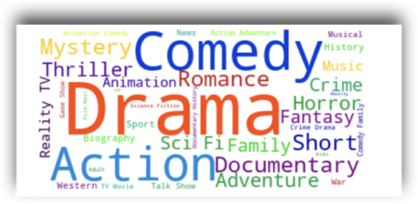
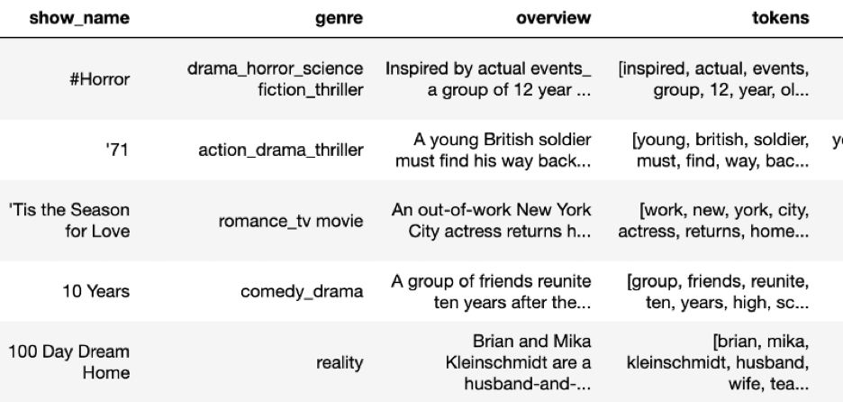
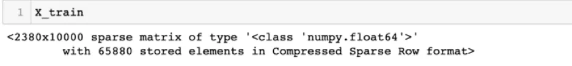
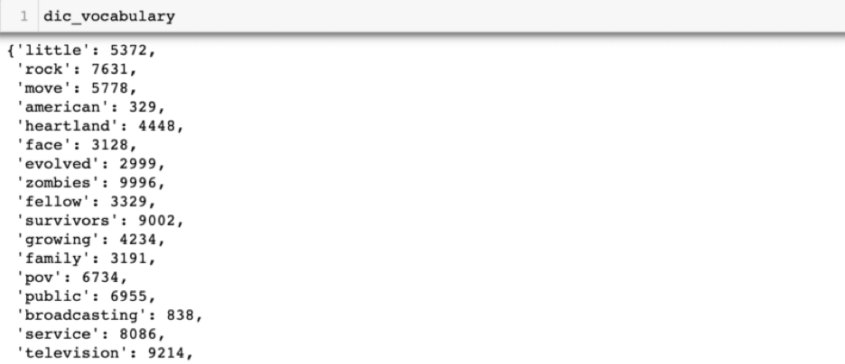
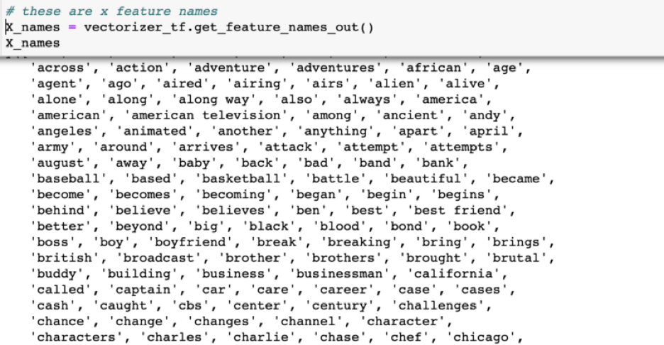
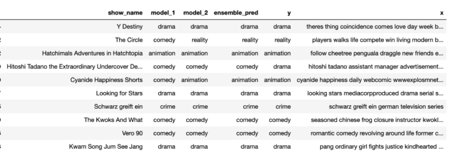
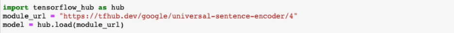
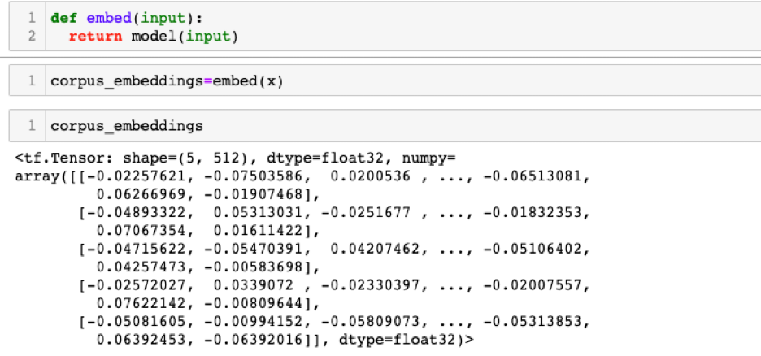
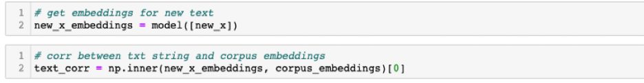

# Predicting Movie Genres using Machine Learning Models and Semantic Textual Similarity



Some people like scary movies, others like drama and some just love sports. Some can't wait for Christmas time to watch those feel good movies while others can't wait for Halloween horror movies. While we all have our favorite movie types, is there a way to know which genres are most popular? Do people actually watch Christmas movies when they first come on in late October? Netflix, Hulu and other providers already categorize shows for us, but how do they do this? In order to answer these questions and more, we need to be able to assign genres to tv shows and movies given a synopsis or description.

In this post, I will discuss:
<li> Data pre-processing: Transforming show descriptions using TFID for machine learning model prediction</li>
<li> Genre predictions using Naive Bayes and ensemble methods</li>
<li> Semantic textual similarity/correlations: TensorFlow sentence encoder</li>


### Data Collection - Finding Show Descriptions and Genres
The first task in predicting genres is finding show descriptions and their genres. The [TMDB API](https://www.themoviedb.org/documentation/api) is a free API built by the community and can be used to pull genre and overview information. It includes many other fields such as release date, keywords and language. While the data is not perfect data, it is still a good source of information.

### Data Preprocessing and Cleaning - A Crucial Step
One very important preprocessing step before building any machine learning models or performing any analysis is data cleaning. The overview field describes what a show is about and can be input by anyone, so I had quite a bit of data cleaning to do, as would be expected with most NLP tasks.

Data preprocessing involved the following steps (and more):
<li>Tokenization: Splitting show descriptions into words</li>
<li>Removing stop words, punctuations and numbers</li>
<li>Remove shows and descriptions that didn't provide any insight on show genre such as 'Synopsis missing' or ones that contained very few words</li>

The reason for this is that we don't want our model to use words or numbers that are not important in predicting a show's genre. For example, we remove words such as "a", "the", "it" (referred to as stop words) because they will not provide any important information in our predicting task.

In the below example, I used the NLTK library to perform some of the preprocessing steps mentioned above. The NLTK library is very useful when you are working with natural language; it contains many algorithms which make preprocessing a lot easier.

```python
from nltk.corpus import stopwords
from nltk import RegexTokenizer

def tokenize_overview(mydata, overview_col):
    """
    Function to clean show overview

    Returns:
    --------
    Return each row as a list of tokens
    """
    # removes punctuation
    tokenizer = RegexpTokenizer(r"\w+")
    stop_words = stopwords.words("English")

    # split text
    tokens = mydata[overview_col].map(lambda x: tokenizer.tokenize(x))
    # strip white spaces & lower case
    tokens = tokens.map(lambda x: [i.lower().strip("_") for i in x])
    # remove stop words
    tokens = tokens.map(lambda x: [i for i in x if i not in stop_words])
    # remove empty strings
    tokens = tokens.map(lambda x: [i for i in x if i != ''])

    return tokens


```

A quick look at the data shows that each row in the tokens column contains a list of words:



### TFIDF Vectorization (Term Frequency-Inverse Document Frequency)
In general, machine learning models don't understand words as features, so we need to do something to convert words to features (a numeric representation). In order to use Naive Bayes or SVM classification models, each row with a synopsis needs to be converted to numeric representation - this is referred to as vectorization.

The scikit-learn python machine learning library provides methods to convert words to numbers: we can use `CountVectorizer` to count the number of times a word appears or we can use `TfidfVectorizer` which converts words to TF-IDF representation.

---

### A little about TF-IDF-Term Frequency Inverse Document Frequency
TF-IDF can be thought of as the weighted score of a word in relation to the document. The idea is to calculate how important a word is to a document in a corpus. Mathematically the formula is:

_TF-IDF = TF(t,d) * IDF (t) = tf(t,d) * log(N/(df+1)_


Which can further be broken down into two parts:

* _Tf(t,d) = term frequency_: number of times term _t_ appears in a _doc d_
* _IDF(t,D) = Inverse document frequency_: a measure of how much information a word provides based on the number of documents the term occurs in.

---

Calculating this by hand seems daunting, but using Tf-Idf from the scikit-learn library is actually quite straightforward! We simply fit the vectorizer on our training corpus after importing and calling the vectorizer. In general, we refer to our text data in NLP problems as corpus/training corpus.

```python 
# import TF-IDF
from sklearn.feature_extraction.text import TfidfVectorizer

# Tf-Idf vectorizer
tf_vec = TfidfVectorizer()
# fit vectorizer on corpus
tf_vec.fit(train_corpus)
```


Next, we transform our corpus to tf-idf representation. This is just one line of code and this happens after we have done our data cleaning.

```python 
# transform corpus to tfidf representation
X_train = tf_vec.transform(train_corpus)
```

We can double check our new training dataset and see that it is now a sparse matrix with numeric datatype


If we wanted to see the features and vocabulary based on the corpus:

```python
# get vocabulary
dic_vocab = tf_vec.vocabulary_
```




If we wanted to see all of the feature names:



#### *_And Finally ...  Model Training ..._*
After the data cleaning and vectorization, we can finally fit a Naive Bayes model in a few lines of code. We can make use of [Pipeline](https://scikit-learn.org/stable/modules/generated/sklearn.pipeline.Pipeline.html) to pass in the fit vectorizer along with our model:
```python
# pipeline: train tf-vec and pass input to Naive Bayes Model
model = Pipeline([("vectorizer", tf_vec),
                  ("classifier", MultinomialNB())])
# train classifier
model["classifier"].fit(X_train, y_train)
```

To train our SVM model, we can use the above Pipeline approach above, or simply run the .fit command:

```python
# import SVM Classifier
from sklearn.linear_model import SGDClassifier
svm = SGDClassifier()
# fit SVM on training data
svm.fit(X_train, y_train)
```

---

### Feature Engineering and Model Improvements
To my surprise and disappointment, initially Naive Bayes and SVM classification models performed very poorly on both training and test data! In order to improve the model performance I had to go back and make several changes to the features and labels. Small changes such as combining "action & adventure" with "adventure", "SciFi" with "science fiction" improved the model performance significantly. The idea was to reduce the number of labels to be predicted by combining some of our overlapping genres.

As a final step, I trained a gradient boosting classification model on the combined output predictions of each model which further increased performance by 5% to about 80% accuracy.

In the below, we see that sometimes the different models don't always predict the same genre, but when these predictions are combined as features in the ensemble model, it outperforms each one individually.



---

## Semantic Textual Similarity - A second Approach
Using TensorFlow we can access [The Universal Sentence Encoder](https://tfhub.dev/google/universal-sentence-encoder/4) and use it to obtain show genres for movies; and we can do this by calculating sentence similarities.

This encoder model is different from other word level embeddings because it is trained on a number of natural language prediction tasks that require modeling the meaning of word sequences rather than just modeling individual words.

In order to use the model, we have to first load it. You can load it once you have downloaded it to your local computer or as I have done below using the web url:



Once the model is loaded, embeddings can easily be produced for show overviews - it is almost like doing a simple lookup: all we need to do is provide the input as a list of sentences. In this case, this will be the cleaned up show descriptions that we would like our model to learn.

The below code returns sentence embeddings for a list of sentences:




### Making Predictions on New Shows
When we have a new show description that we would like to predict, we first need to obtain its embeddings using the same sentence encoder. Next, we take the inner product with the corpus embeddings of our training data. This will represent the semantic similarity between our new show description and our training data.


Lastly, the genre of the training sentence with the highest similarity/correlation will be assigned as the genre for the new show.
In the below example we can see that the show overview for Jane and the Dragon is most correlated with other another animation films, so we have assigned the new genre as animation:


---

### Resources:
* [TMDB API](https://developer.themoviedb.org/docs/getting-started)
* [TFID Vectorizer](https://scikit-learn.org/stable/modules/generated/sklearn.feature_extraction.text.TfidfVectorizer.html)
* [TensorFlow Semantic Similarity](https://www.tensorflow.org/hub/tutorials/semantic_similarity_with_tf_hub_universal_encoder#load_the_universal_sentence_encoders_tf_hub_module)