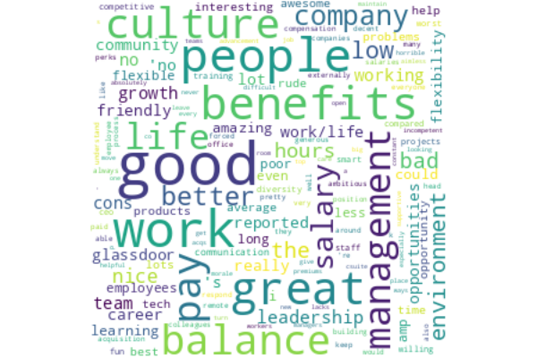
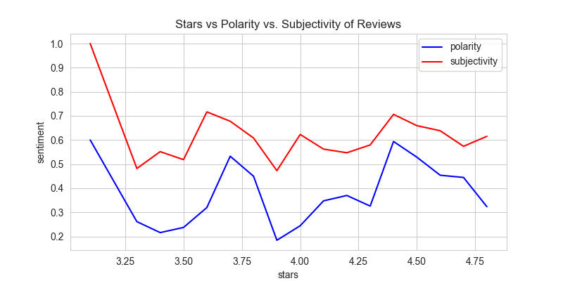
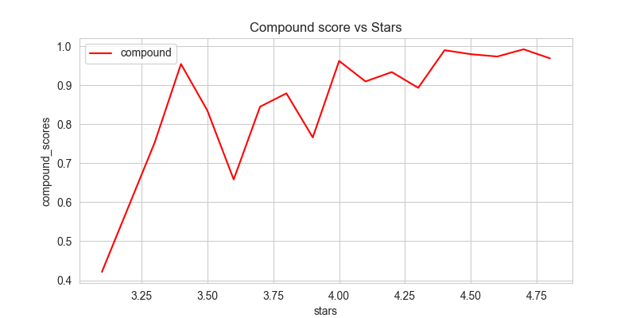
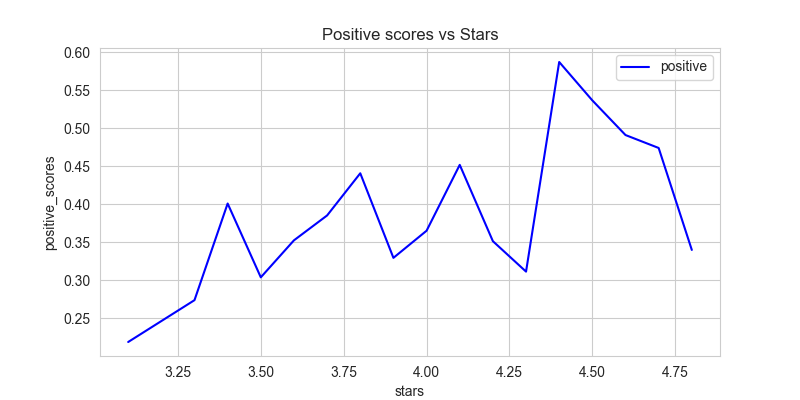
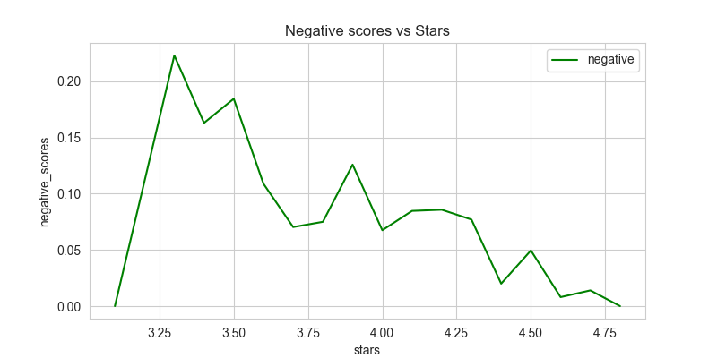

---
hide:
#   - navigation
  - toc
---

# Sentiment Analysis of Data Science Job Reviews on Glassdoor


## Project Overview
The goal of this project was to scrape data science job reviews from glassdoor.com and analyze company reviews. I wanted to perform **sentiment analysis** to understand what users were writing, and to investigate how the number of stars given to a company related to the sentiment in the review. 

✽ For the complete blog, visit my page on [medium.com](https://medium.com/@gabya06/python-sentiment-analysis-using-textblob-and-vader-for-glassdoor-reviews-cc9632babb73). <br>
✽ The complete jupyter notebook is on [github](https://github.com/Gabya06/sentiment_analysis_glassdoor)


## Table of Contents

 1. [Web Scrapping](#webscraping)
 2. [Data Exploration](#dataexploration)
 3. [Sentiment Analysis with TextBlob](#sentiment-textblob)
 4. [Sentiment Analysis with Vader](#sentiment-vader)


<a id="webscraping"></a>
## Web Scrapping Glassdoor Data 
Since glassdoor.com does not have an available API, I decided to try out web scrapping on a few glassdoor.com machine learning job listings with company reviews.  I was only able to scrape a small amount of reviews before getting the 403 Forbidden Error. To scrape data I used Selenium and BeautifulSoup packages. 

Below are two of the main functions I used to scrape data using BeatufifulSoup:

::: functions.get_page
::: functions.get_jobs


### Text Preprocessing
In order to proceed with sentiment analysis, I first had to do some text preprocessing: remove punctuation, numbers and stop words. When working on NLP projects, I am usually a big fan of the NLTK library, but this time I wanted to try out TextBlob. Cleaning text data can be as simple as the below line of code:

```python
# assign new clean review column
df = df.assign(clean_review = df.reviews.map(lambda x: ' '.join(TextBlob(str(x)).words)))
```

In addition, I removed common words such "a", "an","the","in" which usually get ignored by typical tokenizers. These are called stopwords and NLTK includes a list of 40 stop words, but you can add more words and customize your own list of stopwords. 


```python
# Remove stopwords & lowercase
df.clean_review = df.clean_review.map(lambda x: " ".join([i.lower() for i in x.split() if i not in stopwords.words('english')]))
```

<a id="dataexploration"></a>
## Data Exploration & Visualization
Once the data is cleaned I can finally move on to the fun part, visualizations! I wanted to create a word cloud of the most frequent words in the reviews, so I created word counts:

``` py linenums="1"
# collect words
word_list = []
word_list.extend(df.clean_review.str.split())
# flatten list of words - exclude the word reviews
word_list = [item for row in word_list for item in row if item !='reviews']
# create counter - we want word frequencies
word_counts = Counter(word_list)
```

And what words appear the most?
<b>"good", "work", "people", "great", "benefits", "culture", "balance", "pay", "management", "life"</b> are all among the top 10 most common words in the dataset. This isnt surprising, I think it represents what most people are looking for in a good work environment. 


#### WordClouds

Creating wordcloud visualizations are pretty straightforward once you have the word counts:

::: functions.plot_wordcloud




--- 
<a id="sentiment-textblob"></a>
## Sentiment Analysis using TextBlob Polarity and Subjectivity
TextBlob provides the ability to look at sentiment analysis by breaking it down into polarity and subjectivity:

* Polarity is <b>between -1 and 1</b>: it identifies the *most negative as -1* and *positive as +1*
* Subjectivity is <b>between 0 and 1</b> and shows the *amount of personal opinion*: 0 is very objective while 1 is subjective
* TextBlob allows us to see the sentiment for each word using `sentiment_assessment`, so we can get a better understanding of how words are scored


Finding the polarity and subjectivity in a string using TextBlob can be done in a few lines of code:

::: functions.print_polarity_subjectivity


Here is an example output:

Sample Review with 4.1 stars:
*good place retire since benefits good willing sacrifice salary/growth reviews great culture open learning environment reviews nice people work reviews very flexible good work life balance reviews good pay good hours reviews long hours culture staying late reviews difficult maintain good work/life balance reviews bad pay promotion hard get reviews

<b>TextBlob polarity:0.26 and subjectivity:0.63</b>

A quick note, the above sample review was preprocessed, that is, it has stopwords removed, no numbers and stripped whitespaces.

To view the sentiment assessment of each word in our sample sentence:
`TextBlob(sample_string).sentiment_assessments[2]`

Part of the sentiment assessment looks like this. It returns a tuple with (polarity, subjectivity, assessments). We see more negative words "bad", "difficult" and "hard" have negative polarity.

<b>
[(['good'], 0.7, 0.60, None),
<br>(['willing'], 0.25, 0.75, None), 
<br>(['great'], 0.8, 0.75, None),
<br>(['open'], 0.0, 0.5, None),
<br>(['nice'], 0.6, 1.0, None),
<br>(['long'], -0.05, 0.4, None),
<br>(['late'], -0.3, 0.6, None),
<br>(['difficult'], -0.5, 1.0, None),
<br>(['bad'], -0.699, 0.66, None),
<br>(['hard'], -0.29, 0.54, None)]</b>
 


So far so good, it looks like TextBlob assigns a more positive sentiment score to the first review which makes sense and also aligns with the number of stars on glassdoor.com.


### But can we trust stars given in reviews?
* After plotting polarity and stars, we can see that polarity should be increasing as stars increase but this is not the case.
* Polarity is higher for 3.75 star rated reviews than for reviews with 4.0 stars. This is inconsistent with what we would expect.
* We also see the review for the **worse** rating of 3.1 does not correspond to a negative review


``` py linenums="1" hl_lines="5 6"

# let's find worse review
worse_stars = df.stars.min()
worse_review = df[df.stars == df.stars.min()].clean_review.values[0]
worse_company = df[df.stars == worse_stars].company.values[0]
w_polarity = TextBlob(worse_review).polarity
w_subjectivity = TextBlob(worse_review).subjectivity

# here we can see that this review is not bad: Textblob identifies it as more positive than negative based on polarity closer to 1
print(f"{worse_company} with {worse_stars} has the worse review:\n{worse_review}")
print(f"\nBut TextBlob indicates it has {w_polarity} polarity and {w_subjectivity}")
```

#### Output:

Epic Pharma LLC with 3.1 has the worse review:</br>
the people working company nice reviews 'no cons reported glassdoor community</br>
But TextBlob indicates it has 0.6 polarity and 1.0

#### Polarity vs. Subjectivity Chart
When plotting polarity and subjectivity vs. stars given we see that polarity should be increasing as stars increase but that is not always the case. 
For example, polarity is higher for 3.75 star rated reviews than for reviews with 4.0 stars.




----
<a id="sentiment-vader"></a>
## VADER and Sentiment Analysis
>VADER Sentiment Analysis. VADER (Valence Aware Dictionary and Sentiment Reasoner) is a lexicon and rule-based sentiment analysis tool that is specifically attuned to sentiments expressed in social media, and works well on texts from other domains.

It’s important to understand the output VADER provides: 
<br>it is a Python dictionary with keys `neg`, `neu`, `pos`’` — which correspond to *Negative, Neutral*, and *Positive*. It also has a *Compound score* which is a score calculated by normalizing the other 3 scores (neg, neu, pos). This score tells us the *intensity or degree of the sentiment and not the actual values*. Its values range from -1 **for extreme negative sentiment** to +1 **for extreme positive sentiment**.

Using the compound score can be enough to determine the underlying sentiment of a text, because for:

<br>a positive sentiment, **compound ≥ 0.05**<br>
a negative sentiment, **compound ≤ -0.05**<br>
a neutral sentiment, the **compound is between [-0.05, 0.05]**<br>

```py linenums="1"
# initialize sentiment analyzer
sid_obj = SentimentIntensityAnalyzer()
# going back to our sample string
# it has a high compound score! it's positive
sid_obj.polarity_scores(sample_string)
```

Here is our sample string:
>good place retire since benefits good willing sacrifice salary/growth reviews great culture open learning environment reviews nice people work reviews very flexible good work life balance reviews good pay good hours reviews long hours culture staying late reviews difficult maintain good work/life balance reviews bad pay promotion hard get reviews


And the sentiment analyzer output:<br>
`{'neg': 0.137, 'neu': 0.469, 'pos': 0.394, 'compound': 0.9646}`

Once we get all the compound, positive and negative scores we can plot them each against the stars given.


Since compound scores greater than or equal to 0.5 are considered positive we should see a *more linear relationship* in the below chart. We also notice that there is a **dip** in the **compound score between 3.5 and 3.75** which is interesting. To explore this further we could look at reviews with stars between 3.5 and 3.75 and look at word frequencies as well as compound scores.




Here we see the positive scores vs. stars given: 




And lastly, here are the negative scores vs. stars given:


---

### Resources:
* [TextBlob](https://textblob.readthedocs.io/en/dev/index.html)
* [Vader](https://github.com/cjhutto/vaderSentiment)
