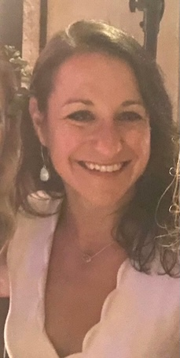

# Welcome to Gaby's Data Science Portfolio

## About Me
I'm a Lead Data Scientist and Machine Learning Engineer in the tech industry, specializing in Natural Language Processing (NLP), multimodal classification, time series analysis, and cloud-based machine learning solutions. I have extensive experience working with Python, deep learning frameworks, and cloud technologies to build scalable and efficient models.

In addition to my industry work, I teach data science, Python, Machine Learning, Data Science and SQL to students at all levels, helping them develop technical expertise and problem solving skills. As a consultant and mentor, I guide junior data scientists through real-world challenges, offering insights into best practices and industry trends.

Beyond my work, I enjoy writing about the latest advancements in AI and data science, sharing insights from my projects, and reflecting on my experiences in teaching and mentoring. Knowledge sharing is at the core of what I do! You can explore my blog posts on [medium.com/gabya06](https://medium.com/@gabya06).

