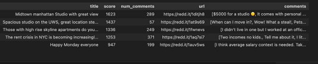

# Reddit API data pull using PRAW

### Project Overview
The goal of this project was to learn how to pull Reddit data using the python package PRAW. In particular, I am interested in learning how Reddit users are feeling about New York City Apartment Rentals. There is a subgroup called NYC Apartments and the goal is to pull user posts and comments to gage how they feel (this will part 2 of this post). 
 
I wrote an article on my page on [medium.com](https://medium.com/@gabya06/automating-reddit-summaries-pulling-data-with-python-91afeb6acdb3) and I also wanted to share the jupyter notebook.


Once I have extracted Reddit posts and comments, the next step in this project is to use pre-trained models on Hugging Face and categorize sentiments to understand how Reddit users feel about renting apartments in New York City. Lastly, the 3rd part of this project will be to use OpenAI to summarize posts and comments. 


### Getting Started with PRAW
PRAW stands for Python Reddit API Wrapper and that's exactly what it is. Although I was a bit intimidated initially, using it turned out to be quite easy. To start, I had to create a [Reddit App](https://www.reddit.com/prefs/apps) to create a `client_id` and `client_secret` - which I saved in a credential file. Simple enough, right? 

After this, I had to install PRAW:

```bash
pip install praw
```

To establish a connection, use the credentials from your Reddit app:

``` python
# Connect to Reddit API using PRAW
reddit = praw.Reddit(
    client_id=client_id,
    client_secret=client_secret,
    password=client_password,
    user_agent=user_agent,
    username=user_name,
)
```

And that's it! On to pulling data! As I mentioned, I am interested in the NYC Apartment subreddit. It is called ''. To pull data, I have to create an instance:

``` python
# Create an instance of NYCapartments subreddit
sub_reddit = reddit.subreddit("NYCapartments")
```

With PRAW, we can easily grab posts by week, month or year. In this example, I wanted to just grab the top 5 posts from the past week to understand how the data is returned. The below code returns the post title, upvotes (score) and comments. 

``` python
# Get the top 5 posts from the past week
weekly_posts = sub_reddit.top(time_filter='week', limit=5)

# Print post titles, scores and comments
for post in weekly_posts:
    print(f'Post title: {post.title}')
    print(f'Post upvotes: {post.score}')
    print(f'Post comments: {post.comments}')
    print()
```

Here is what a sample output looks like:

```
Post title: Looking for roommates to fill $1667 rooms in Park Slope
Post upvotes: 279
Post comments: <praw.models.comment_forest.CommentForest object at 0x28d081790>

Post title: Age discrimination in NYC rentals?
Post upvotes: 113
Post comments: <praw.models.comment_forest.CommentForest object at 0x28d1f4d90>
```

Interestingly, `post.comments` returns an object called `comment_forest`. In order to see the actual comments, we need to further be processed this, but it's not too difficult. I created a list to store all comments and iterated through the comments. For each post, I created a post dictionary with the comments:

```python
# Pull posts from last year NYCapartments subreddit
post_list = []

for post in subrreddit:
    post_dict = {}
    post_comments = []
    # Retrieve full comments, including nested ones
    post.comments.replace_more(limit=None)
    for top_level_comment in post.comments:
        post_comments.append(top_level_comment.body)
    post_dict['comments'] = post_comments
    post_list.append(post_dict)

result_df = pd.DataFrame(post_list)    
```

Note the use of `replace_more` to retrieve all comments, including nested ones. This ensures you don’t miss out on any key discussion points. You can find the documentation [here](https://praw.readthedocs.io/en/stable/tutorials/comments.html).

Here is what the data looks like:


