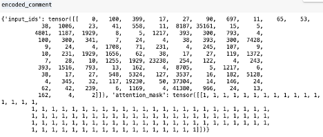
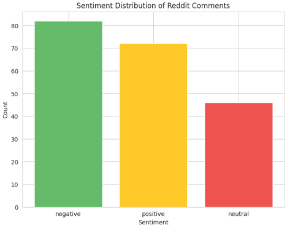

---
hide:
#   - navigation
  - toc
---

# Sentiment Analysis of Reddit Comments Using RoBERTa


## Project Overview
This project applies sentiment analysis to Reddit comments using **RoBERTa**, a powerful NLP model developed by Meta AI. RoBERTa is fine-tuned on millions of tweets and can be used to classify text as positive, neutral, or negative, making it well-suited for analyzing online discussions.
RoBERTa is available on **Hugging Face**, a platform hosting 900k+ models, 200k+ datasets, and 300k+ demo applications, fostering collaboration in machine learning.

✽ The full article can be found on my page on [medium.com](https://medium.com/@gabya06/hugging-face-roberta-model-for-sentiment-analysis-4f52e9ccb490). <br>
✽ The corresponding code can be found in [github](https://github.com/Gabya06/RentWatchAI/blob/main/roberta_sentiment_analysis.ipynb).<br>


## Table of Contents
1. [Install Dependencies](#setup)
2. [RoBERTa Model & Tokenization](#roberta)
3. [Sentiment Prediction](#prediction)
4. [Visualization](#vis)

<a id="setup"></a>
### 1. Install Dependencies

Let's instal the required library to use RoBERTa:

```bash
pip install transformers torch matplotlib
```

And let's load the model and tokenizer:

```py linenums="1"
from transformers import AutoModelForSequenceClassification, AutoTokenizer

model = AutoModelForSequenceClassification.from_pretrained("cardiffnlp/twitter-roberta-base-sentiment")  
tokenizer = AutoTokenizer.from_pretrained("cardiffnlp/twitter-roberta-base-sentiment")
```

In the [first post](../reddit_api/readme.md) of this, I extracted Reddit post and comments from the subreddit NYC Apartments. 
This is dataset that is used in this project; it consists of 200 sample rows with over 8,000 comments.

Let's take a sample comment:

``` py linenums="1"
sample_comment = """
I didn't live in one but I worked at an office in Hudson Yards on the 72nd floor and the view never got old.
I got used to it. I never got tired of it.
I got used to mine, but continued to vicariously live through other people when they saw it the first time.
Impressed my girlfriend at the time enough to become my wife so all in all worth it.
But after 6.5 years of a 6-floor walk-up, I'm happy to be a ground-floor dweller now.
It never gets old for me. Besides the view, I've noticed my apartment is very quiet.
There are no bugs or rodents that make it up this high, either. Totally worth it for me.
"""
```

If I had to guess, I would classify this comment as positive — I see positive keywords like ‘positive’, ‘never gets old’, ‘no bugs’, ‘worth it’. 
Let's use machine learning to classify it as positive, negative, or neutral.

<a id="roberta"></a>
### 2. Tokenize the Text and Model Prediction

To prepare the comment for RoBERTa, we need to convert it into a format the model understands. 
This means using the tokenizer to transform the text into numerical representations:


``` py linenums="1"
encoded_comment = tokenizer(
    sample_comment,
    return_tensors='pt',
    truncation=True,
    max_length=512
)
```

Note that I set `max_length` to 512 because this model can process *up to 512 tokens* at a time. 
This limit ensures that our input fits within the model's capabilities.

Let's take a closer look at what `encoded_comment` consists of:


`input_ids` represent the numerical values of the words in the text, and 
`attention_mask` is a tensor with **1's or 0's** indicating which tokens should be **attended** to during processing.


Next, let's make some predictions:

``` py linenums="1"
import torch

output = model(**encoded_comment)
logits = output.logits
```

Here is an example of what `output` looks like - it contains the **logits**:
```
SequenceClassifierOutput(loss=None, logits=tensor([[-1.9768,  0.1379,  2.0923]], grad_fn=<AddmmBackward0>), hidden_states=None, attentions=None)
```

<a id="prediction"></a>
### 3. Interpreting Model Output
The model returns **raw logits**, which must be converted into probabilities:

``` py linenums="1"
import torch.nn.functional as F

probs = F.softmax(logits, dim=1)
print(probs)
```

Example output:
```
tensor([[0.0148, 0.1222, 0.8630]])
```

As a final step, we need to map these probabilities to the sentiment labels:
``` py linenums="1"
from transformers import AutoConfig

config = AutoConfig.from_pretrained("cardiffnlp/twitter-roberta-base-sentiment")
predicted_label_index = torch.argmax(probs).item()
print(f"Predicted sentiment is: {config.id2label[predicted_label_index]}")

# output
# Predicted sentiment is positive
```
For our sample, the prediction is *positive*! 
The model agrees with our initial classification. Although we’ve only classified one comment here, it’s always a good practice to verify model predictions against initial observations to see if they align with our intuition. While it’s not feasible to do this for all data, spot-checking a few predictions helps ensure the model’s results make sense.

Once we have performed this across the entire data, we can sample some comments and print their sentiment and probabilities:
``` py linenums="1"
for ix, row in data[['cleaned_text','sentiment','sentiment_prob']].sample(3).iterrows():
  print(f"{row['cleaned_text'][:200]}")
  print(f"Sentiment: {row['sentiment']}")
  print(f"Probability: {row['sentiment_prob']}\n")
```

Here are the sample results (up to 200 characters):
```
congratulations what site did you use for a rent stabilized place? my first place in nyc 10 years ago was a room with 4 other roommates in a walk up. fast forward 10 years and my dream apartment (also
Sentiment: positive
Probability: 0.929

34 market is a great example of this tax being totally needed   also my building is half empty and units are infested with rats because no none lives in them   some have broken windows which makes the
Sentiment: negative
Probability: 0.599

bring back mitchell llama and public housing developments, if the private sector won’t build, swing the pendulum back to the public sector.  watch the prices drop as supply returns. i have very little
Sentiment: neutral
Probability: 0.535
```

<a id="vis"></a>
### 4. Visualization

To get a clearer view of our sentiment analysis results, let’s plot a few charts

 showing the distribution of positive, neutral, and negative comments. This will help us quickly understand which sentiment is most prevalent in our data.

* Sentiment distribution - a big majority of comments are negative
* Sentiment probability distributions: positive and negative are wider ranging and neutral is smallest




---

### Resources:
[HuggingFace](https://huggingface.co/)
[Soft Max](https://medium.com/@hunter-j-phillips/a-simple-introduction-to-softmax-287712d69bac)
