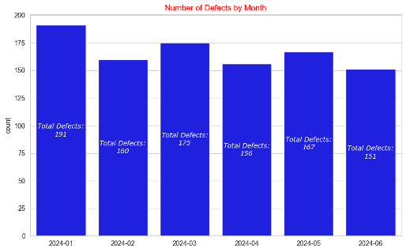
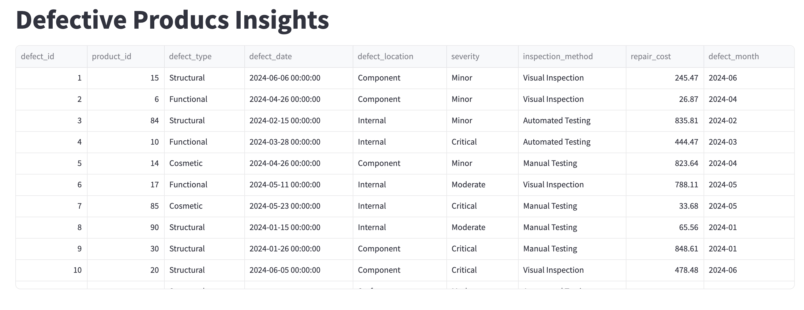
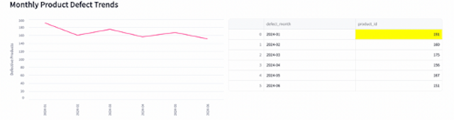

---
hide:
#   - navigation
  - toc
---

# Building a Streamlit App for Product Defect Analysis


## Project Overview
This project demonstrates how to build a Streamlit web application for analyzing product defects using data visualization techniques in Matplotlib and Seaborn. The dataset, sourced from [Kaggle](https://www.kaggle.com/datasets/fahmidachowdhury/manufacturing-defects/data), contains product defect reports with repair costs, defect severity levels, and inspection methods. The goal is to generate insights through *interactive visualizations* and streamline *data exploration*.

✽ The full article can be found on my page on [medium.com](https://medium.com/@gabya06/creating-your-first-streamlit-app-with-matplotlib-seaborn-7e888e8a7470).<br>
✽ The corresponding code can be found in [github](https://github.com/Gabya06/defective_products).<br>


## Table of Contents
1. [Creating Charts with Matplotlib and Seaborn](#charts)
2. [Streamlit App: Getting Started](#streamlit-start)
3. [Streamlit App: Interactive Visualizations](#streamlit-app)
4. [Running the Streamlit App](#running-the-streamlit-app)

<a name="charts"></a>
### 1. Creating Charts with Matplotlib and Seaborn
The dataset consists of 1,000 rows and 8 columns, so we can process it quickly using Pandas.


The project goal is to explore the following questions and build charts to visualize the answers:

* How many defective products are reported on a monthly basis?
* How do repair costs vary by severity?
* How do trends in repair costs vary by inspection method?

### Example: Monthly Defect Trends
```py linenums="1"
# Preprocessing
df = pd.read_csv('defects_data.csv')
df['defect_date'] = pd.to_datetime(df['defect_date'])
df['defect_month'] = df['defect_date'].dt.strftime('%Y-%m')

# Aggregation
monthly_defects = df.groupby('defect_month', as_index=False)['product_id'].count()

# Visualization
fig, ax = plt.subplots(figsize=(10,6))
sns.barplot(data=monthly_defects, x='defect_month', y='product_id', 
    ax=ax, color='blue')
# Add a label to each bar container - specify format, color and font
ax.bar_label(ax.containers[-1], fmt='Total Defects:\n%.0f', 
    color='white', size=10)
# Update title and labels
ax.set_title('Number of Defects by Month', color='red')
ax.set_ylabel('Count')
ax.set_xlabel('')
plt.show()
```

Here is our resulting chart:




<a name="streamlit-start"></a>
### 2. Streamlit App: Getting Started
Streamlit provides a Python-based framework for *deploying data science applications with minimal effort*. The app is structured in `app.py`, leveraging Streamlit's layout capabilities.


To get started with Streamlit, we first need to install it and then import it. Once installed, create a file called `app.py`, where we will import the necessary libraries for data manipulation and chart creation, and where we will built our **first Streamlit app!** 

#### Installation and Setup
``` bash
pip install streamlit pandas matplotlib seaborn
```

### Example: Display Data as a Table in Streamlit:
```py linenums="1"
# app.py

# Import libraries
import matplotlib.pyplot as plt
import seaborn as sns
import streamlit as st
import pandas as pd

# Read data
df = pd.read_csv("defects_data.csv")

# Configure page to wide layout
st.set_page_config(layout="wide")

# Add app title 
st.title("Defective Producs Insights")

# Show data
st.dataframe(
    data=df.head(20),
    hide_index=True,
    use_container_width=True,
)
```

#### Running the App
Once you have saved the file, you can run the app by doing the following in your terminal:

``` bash
streamlit run app.py
```

And Voila!




<a name="streamlit-app"></a>
### 3. Streamlit App: Interactive Visualizations
Streamlit integrates seamlessly with Matplotlib and Seaborn, enabling dynamic visualizations. It can also create its own [charts](https://docs.streamlit.io/develop/api-reference/charts).

#### Example: Monthly Defects Line Chart
```py linenums="1"
# Streamlit Visualization
st.subheader("Monthly Product Defect Trends")
# Add left and right columns
left, right = st.columns(2)
# Create line chart for monthly trends in left column
left.line_chart(
    data=monthly_defects,
    x="defect_month",
    y="product_id",
    color="#FF3389",
    x_label="",
    y_label="Defective Products",
    use_container_width=True,
)
# Show summary data on the right side
right.dataframe(
    monthly_defects.style.format(thousands=",", precision=2).highlight_max(
        subset=["product_id"]
    ),
    use_container_width=True,
)

```

Our app now includes the line chart and table:




#### Example: Top Repair Costs
Imagine you are tasked with investigating which products incurred the *highest repair costs*. We can create a bar chart to show the *top 10 products by repair cost* and add it to `app.py`:

``` py linenums="1" hl_lines="5 6 11 13"
# Product aggregation
top_repairs = df.groupby('product_id', as_index=False).agg({
    'repair_cost':'sum'}).sort_values(by='repair_cost', ascending=False)[:10]

# Streamlit UI - header and columns
st.subheader("Top 10 Product Repair Costs", divider="blue")
left_col, right_col = st.columns(2)

fig, ax = plt.subplots(figsize=(8,6))
sns.barplot(data=top_repairs, x='repair_cost', y='product_id', 
    palette='Set1', orient='h', ax=ax)
ax.set_xlabel("Total Repair Cost")
left_col.pyplot(fig)

right_col.dataframe(top_repairs.style.format(
    thousands=",", precision=2).highlight_max(subset=["repair_cost"]), 
    hide_index=True)
```

<a id="running-the-final-app"></a>
### 4. Running the Final Streamlit App
Once you're done adding all the bells and whistles to your app, go ahead and run it!


